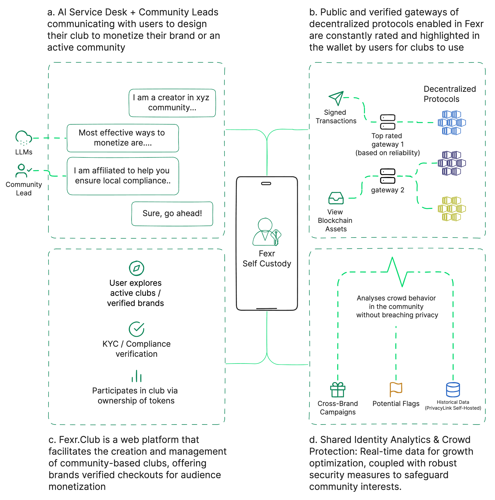
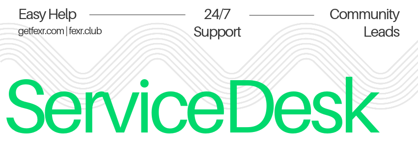

> **Note:** This article discusses features of Fexr.Club, which is set to launch in later 2024. The functionalities and offerings are forward-looking and may be subject to changes before the official launch. We appreciate your patience as we work diligently to bring this innovative platform to life.

> **Call for Contribution:** The development process is led by limited developers who are dedicated to realizing our vision. If you're passionate about making a significant contribution to this endeavor and believe in the potential of Fexr.Club, we invite you to join hands with us. Serious contributors are welcomed to step in and participate by reaching out to me [via mail](mailto:nidhin@fexr.club). Together, we can accelerate the journey towards a groundbreaking launch and shape the future of reward economics and community engagement.

In the age of artifical intelligence, blockchain, and decentralized finance, it's easy to get carried away by the allure of new models that promise to redefine commerce and community engagement. At the forefront of this revolution is Fexr.Club, a platform that leverages the best of decentralized technology to offer brands and communities unique ways to monetize and grow. But before you make any assumptions, let's set the record straight: Fexr.Club is not here to replace your bank or your mutual fund. It's here to complement regulated financial systems by providing a robust reward mechanism within a community-based setting. 

## The Three Pillars of Fexr

1. **AI Service Desk + Community Leads:** This pillar is designed to help brands and active communities design their Web3 Clubs to better monetize and engage with their audience. Through intuitive AI and human guidance, clubs can tailor their strategies to better serve and profit from their communities.

2. **Public and Verified Gateways:** Fexr.Club offers a selection of vetted decentralized protocols which are rated and reviewed by the community. These trusted platforms provide secure and efficient means for clubs to transact and grow.

3. **Web Platform for Club Creation:** At its core, Fexr.Club facilitates the creation and management of community-based clubs. These clubs can, in turn, offer verified checkouts and unique experiences, providing both brands and communities opportunities for audience monetization.

## The Fourth Pillar: Shared Identity Analytics & Crowd Protection

In the interest of making the platform as holistic as possible, we also provide real-time data analytics for both brands and communities. These insights help in optimizing growth strategies and come equipped with stringent security measures to safeguard the interests of the community.

## Fexr.Club and Traditional Financial Systems: A Symbiotic Relationship

It is essential to understand that Fexr.Club operates alongside regulated financial systems, not against them. Traditional banking systems provide the bedrock of financial stability, while Fexr.Club offers a layer of community engagement and reward that traditional systems might lack. Through the use of blockchain technology and smart contracts, the platform offers a more transparent, accountable, and efficient mechanism for transactions and rewards.

## Regulatory Compliance

Transparency is at the heart of Fexr.Club, and this extends to our commitment to compliance. The platform works in harmony with financial regulations to ensure a safe and secure environment for all participants. In essence, we offer the best of both worlds: the innovation and engagement of decentralized systems with the security and reliability of traditional financial infrastructures.

## The Future of Fexr.Club: Infinite Possibilities

As the platform grows, so do the opportunities for our users. With plans to introduce more features, our vision is to create an ecosystem that is not just beneficial but also versatile, enabling various types of community-based transactions and interactions.

In conclusion, Fexr.Club is here to complement the current financial systems by offering an innovative model of engagement and reward. It’s designed to bring a community together, giving brands and individual users a unique platform to monetize and grow, all while adhering to financial regulations and ensuring crowd protection. So, when you join the Fexr.Club, you're not just embracing a new model; you're becoming part of a new, vibrant community that values the balance between innovation and security.

By offering a platform that provides both a fresh approach to community engagement and a firm commitment to regulatory compliance, Fexr.Club is charting a path for the future—one that harmonizes rather than replaces traditional financial systems.

### Revenue Streams: A Diversified Portfolio

One of the most compelling aspects of Fexr.Club is its multiple revenue streams. The platform generates income from commissions on brand deals, and premium services that offer enhanced analytics and security features. This diversified revenue model not only maximizes profitability but also hedges against market volatility.

### Scalability and Network Effects

The design of Fexr.Club inherently promotes network effects. As more clubs join the ecosystem and utilize the public and verified gateways, the value of the platform increases for both new and existing members. The scalability of Fexr.Club is designed to accommodate millions of users without compromising on speed or security, thanks to its robust technological architecture.

### Low Barrier to Entry, High Value to User

Unlike some other platforms that require significant upfront investment, Fexr.Club offers a low barrier to entry, making it accessible for a broad range of users. This inclusive approach, coupled with high user value through the rewards system, increases the user adoption rate, thereby growing the potential market size.

## Conclusion: Don't Miss Out on the Future

Fexr.Club is more than just a platform; it's a paradigm shift in how we understand community engagement and financial rewards. Our commitment to regulatory compliance ensures a risk-mitigated investment, while our focus on innovation provides ample avenues for growth and profitability. 

So, as we tread boldly into the future, we extend an invitation for you to be part of this groundbreaking journey. Investing in Fexr.Club is not just investing in a platform but in a philosophy that harmonizes the traditional with the modern, the regulated with the decentralized, and the individual with the community.

For those still contemplating, remember: The future is infinitely better together, and with Fexr.Club, that future is both secure and profitable.